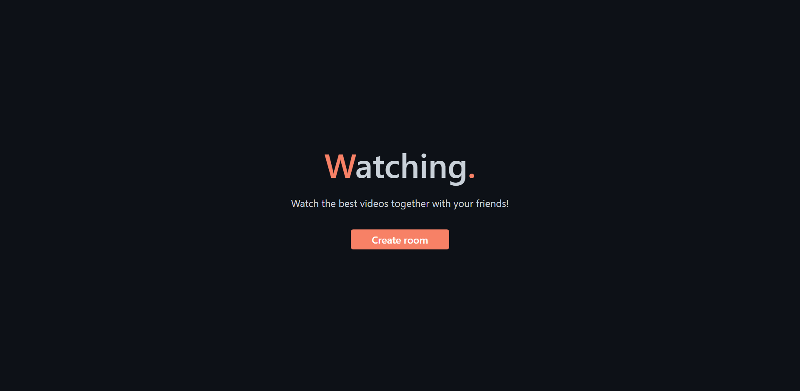

<div align="center" id="top">
  

</div>

<h1 align="center">Watching</h1>

<p align="center">
  

  

  

  
</p>

<p align="center">
  <a href="#dart-about">About</a> &#xa0; | &#xa0;
  <a href="#rocket-technologies">Technologies</a> &#xa0; | &#xa0;
  <a href="#white_check_mark-requirements">Requirements</a> &#xa0; | &#xa0;
  <a href="#checkered_flag-starting">Starting</a> &#xa0; | &#xa0;
  <a href="#memo-license">License</a> &#xa0; | &#xa0;
  <a href="https://github.com/maurodesouza" target="_blank">Author</a>
</p>

## :dart: About ##

The Watching app allows you to create a room and watch a video together with others in real time.

I made this project to learn a bit about firebase and its real-time database functionality.

## :rocket: Technologies ##

The following tools were used in this project:

<a href="https://www.typescriptlang.org" target="_blank">
  
</a>

<a href="https://pt-br.reactjs.org" target="_blank">
 
</a>

<a href="https://nextjs.org" target="_blank">
  
</a>

<a href="https://firebase.google.com" target="_blank">
  
</a>

<br>
<br>

## :white_check_mark: Requirements ##

Before starting :checkered_flag:, you need to have [Git](https://git-scm.com) and [Node](https://nodejs.org/en/) installed, and also have an app created on [Firebase](https://firebase.google.com).

## :checkered_flag: Starting ##

```bash
# Clone this project
$ git clone https://github.com/maurodesouza/watching

# Access
$ cd watching

# Touch a .env.local file and fill it according to .env.example

# Install dependencies
$ yarn

# Run the project
$ yarn dev

# The server will initialize in the <http://localhost:3000>
```

## :memo: License ##

This project is under license from MIT. For more details, see the [LICENSE](LICENSE.md) file.


Made with :heart: by <a href="https://github.com/maurodesouza" target="_blank">Mauro de Souza</a>

&#xa0;

<a href="#top">Back to top</a>
